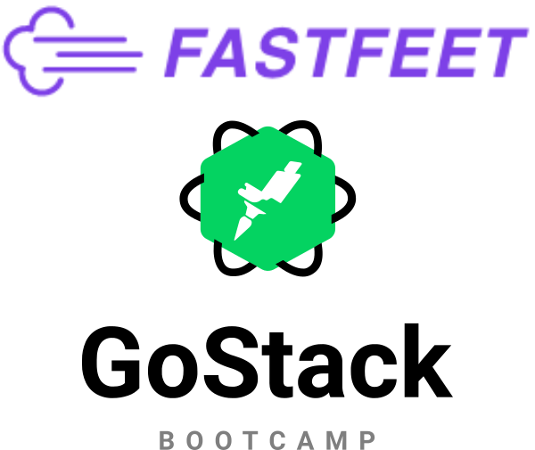

<h1 align="center">
  
</h1>

<p align="center">Este codigo representa a minha solução do desafio do Bootcamp GoStack 10.0</p>

<p align="center">
 <a href="#rocket-tecnologias">Tecnologias</a>&nbsp;&nbsp;&nbsp;|&nbsp;&nbsp;&nbsp;
 <a href="#computer-instalação-execução-e-desenvolvimento">Instalação, execução e desenvolvimento</a>&nbsp;&nbsp;&nbsp;
</p>

<p id="insomniaButton" align="center">
  <a href="https://insomnia.rest/run/?label=FastFeet&uri=https%3A%2F%2Fraw.githubusercontent.com%2Fjacksonroberto%2Ffastfeet%2Fmaster%2FInsomnia.json" target="_blank"></a>
</p>

<strong>Links dos desafios:</strong>

- [Etapa 1](https://github.com/jacksonroberto/fastfeet/blob/master/server/ETAPA_01.md)
- [Etapa 2](https://github.com/jacksonroberto/fastfeet/blob/master/server/ETAPA_02.md)
- [Etapa 3](https://github.com/jacksonroberto/fastfeet/blob/master/web/ETAPA_03.md)
- [Etapa 4](https://github.com/jacksonroberto/fastfeet/blob/master/mobile/ETAPA_04.md)

## :rocket: Tecnologias

Esse projeto foi desenvolvido com as seguintes tecnologias:

- [Node.js](https://nodejs.org/en/)
- [React](https://reactjs.org/)
- [Docker](https://www.docker.com/)
- [Docker Compose](https://docs.docker.com/compose/)
- [PostgreSQL](https://www.postgresql.org/)
- [MongoDB](https://www.mongodb.com/)
- [Express](https://github.com/expressjs/express)
- [Redis](https://redis.io/)
- [Bee-Queue](https://github.com/bee-queue/bee-queue)

## :computer: Instalação, execução e desenvolvimento

Importe o arquivo `Insomnia.json` no Insomnia ou clique no botão [Run in Insomnia](#insomniaButton)

### Pré-requisitos

- [Node.js](https://nodejs.org/en/)
- [Yarn](https://legacy.yarnpkg.com/en/) (Optional).
- [Docker](https://www.docker.com/)
- [Docker Compose](https://docs.docker.com/compose/)

**Faça um clone desse repositório**

### Backend


- API RESTFUL criada com Node.js usando [express](https://expressjs.com/pt-br/).
- Banco de dados usado PostgresSQL com [sequelize](https://sequelize.org/v5/).

- A partir da raiz do projeto, entre na pasta rodando `cd server`;
- Rode `yarn` para instalar sua dependências;
- Rode `cp .env.example .env` e preencha o arquivo `.env` com SUAS variáveis ambiente;
- Rode `docker-compose up -d` para montar o ambiente;
- Rode `yarn sequelize db:migrate` para executar as migrations;
- Para executar somente a migration de `admin-user` rode o comando `yarn sequelize db:seed --seed 20200212180839-admin-user.js`
- Rode `yarn dev` para iniciar o servidor;

### Web

_ps: Antes de executar, lembre-se de iniciar o backend deste projeto_

- A partir da raiz do projeto, entre na pasta do frontend web rodando `cd web`;
- Rode `yarn` para instalar as dependências;
- Rode `yarn start` para iniciar o client web;

### Outros comandos:

```
$ cd backend

$ yarn

$ yarn sequelize db:create

$ yarn sequelize db:migrate

$ yarn sequelize db:seed:all

$ yarn dev
```


### Mobile

Obs.: Esse projeto mobile foi testado apenas no **Android**.

_ps: Antes de executar, lembre-se de iniciar o backend deste projeto_

- A partir da raiz do projeto, entre na pasta do frontend mobile rodando `cd mobile`;
- Rode `yarn` para instalar as dependências;
- Edite o arquivo `mobile/src/services/api.js`, alterando `baseURL` para o IP correspondente a máquina que estiver executando o `backend`;
- Abra o emulador do Android ou conecte seu dispositivo via USB, em seguida, rode `yarn react-native run-android`;

#### Outros comandos:

```
yarn dev:debug
```
